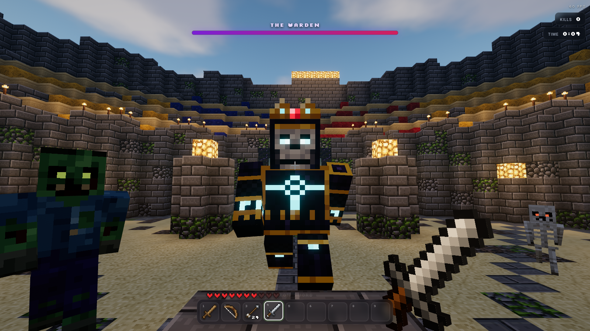
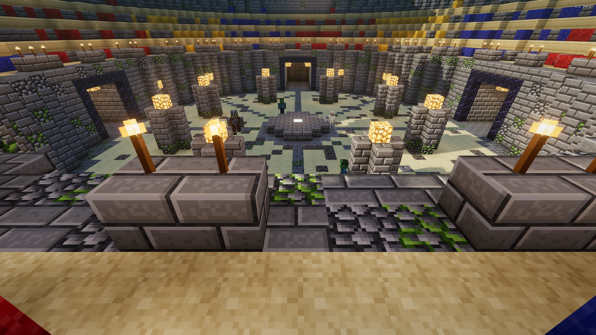
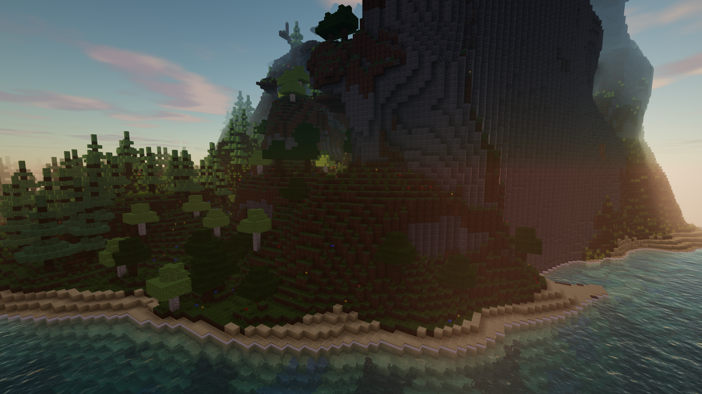
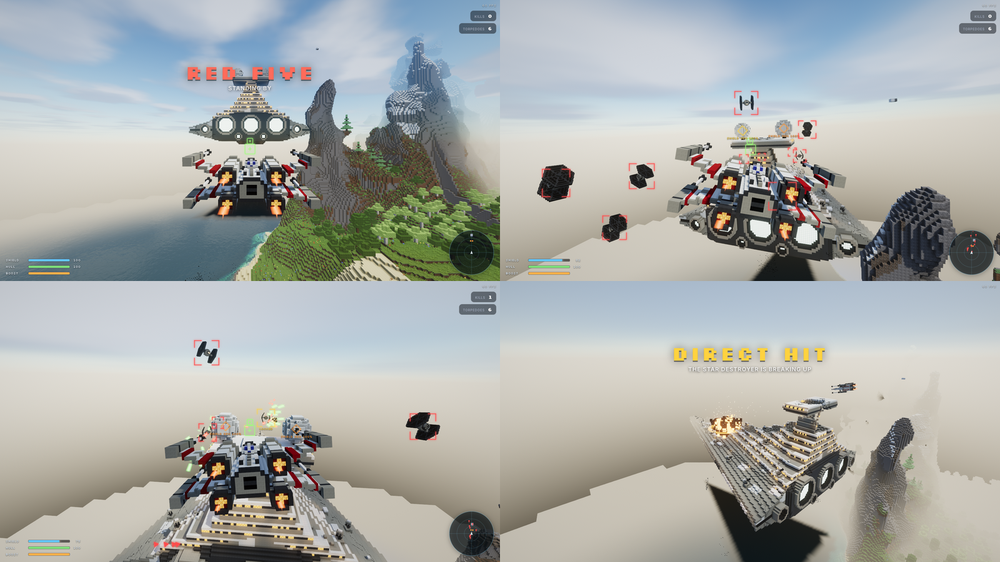
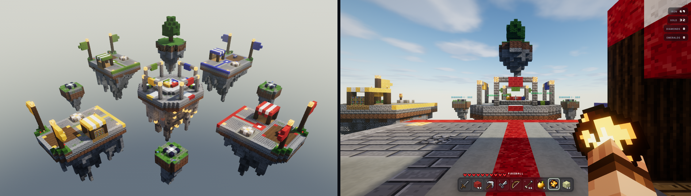
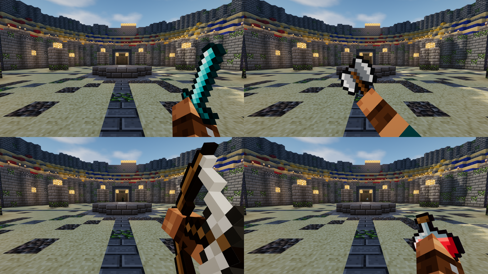
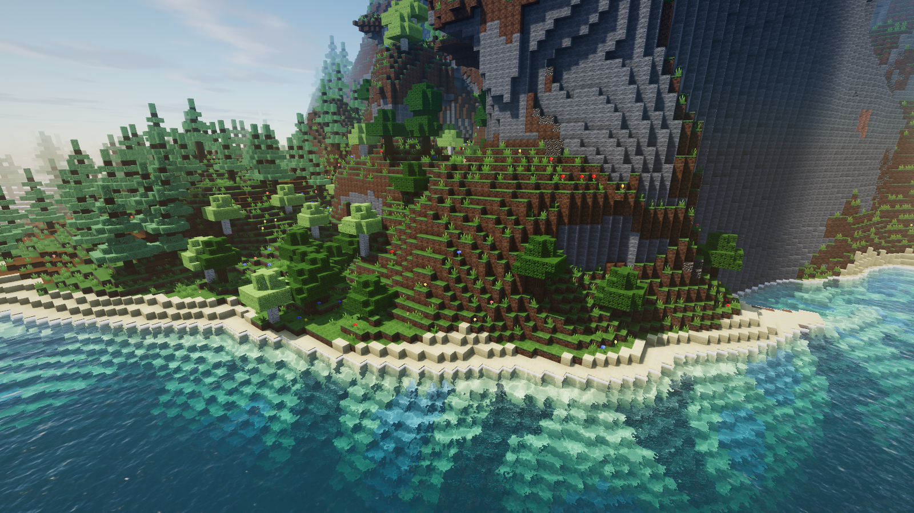
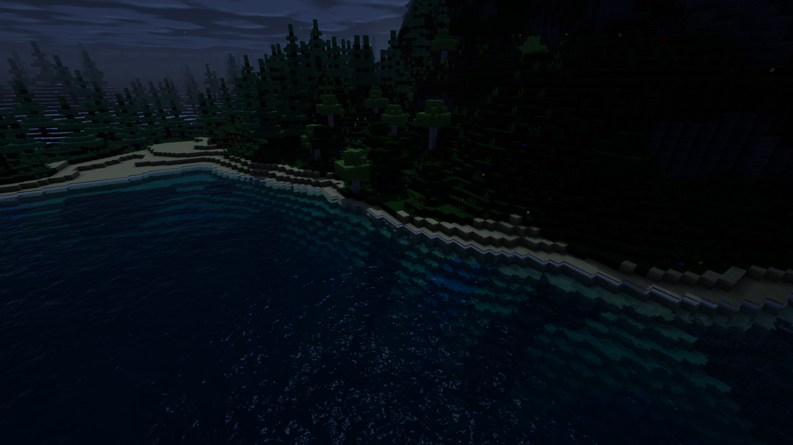

# Voxel

A voxel game platform that runs in the browser. The engine gives you a Minecraft-style world that is already built: an endless procedural world, lighting, a shader pipeline, physics, entities, items, combat, audio and UI. A game on top of it is a single TypeScript module that only describes rules and content.

The compute-heavy work (terrain generation, lighting, meshing, physics, path-finding, projectiles, raycasting, visibility culling and shadow-camera math) is Rust compiled to WebAssembly. three.js on WebGL2 does the rendering, through a custom shader pipeline.



| The colosseum | Sandbox at sunset |
| --- | --- |
|  |  |







## Games

| Game | URL | What it is |
| --- | --- | --- |
| **Arena** | `?game=arena` | Six waves of zombies, skeleton archers, spiders and brutes in a colosseum, then the Warden boss. Weapons drop on the dais between waves: bow, stone/iron/diamond swords, a two-handed pike, battle axe and potions. About 560 lines, including the colosseum and the boss AI. |
| **Starfighter** | `?game=starfighter` | A Star Fox-style dogfighter with block-built X-wing, TIE fighter and TIE interceptor. Fight two waves of TIEs over the sea, then take on a 200-block Star Destroyer built into the world: knock out its two shield generators and blow up the bridge. Mouse to fly, W/S boost and brake, Q/E barrel roll (deflects lasers), right-click proton torpedoes. Uses `player.controller: 'none'` and flies the camera itself. |
| **Bed Wars** | `?game=bedwars` | Hypixel-style Bed Wars against three bots on sky islands. Collect iron and gold from your generator (diamonds and emeralds on the outer and middle islands), buy blocks, swords, armour, tools, fireballs and team upgrades from the shopkeeper, bridge across the void and break the other beds. You respawn only while your bed stands. The bots fortify, shop, bridge, dig through defences and fight each other as well as you. |
| **Sandbox** | `?game=sandbox` | Creative building in an endless world. Edits are saved per seed. 17 lines. |
| **Heart Hunt** | `?game=heart-hunt` | The tutorial: find ten hearts. About 70 lines. |

The title screen lists every registered game. The pause menu offers restart and exit.

**To write your own game, read [docs/PLATFORM.md](docs/PLATFORM.md).** In short:

```ts
import { defineGame, Blueprint, HeldModels, Models, Skins, Behaviors } from '@platform';

// A ring wall, stamped into the world during generation.
const ring = new Blueprint({ x: -12, y: 70, z: -12 }, { x: 25, y: 4, z: 25 });
ring.columns(0, 0, 12, (x, z, d) => d > 11 && ring.fill({ x, y: 70, z }, { x, y: 73, z }, 'stone_bricks'));
let won = false;

export default defineGame({
  id: 'my-game',
  title: 'My Game',
  world: {
    structures: [ring],
    terraform: [{ x: 0, z: 0, radius: 14, blend: 16, height: 69.5 }],
    spawn: { x: -6, y: 71, z: 0.5 },
    spawnYaw: -Math.PI / 2, // face +x
  },
  player: { health: 20, hotbar: 'items' },
  setup(game) {
    game.items.define('iron_sword', {
      kind: 'melee', name: 'Iron Sword', icon: 'iron_sword', damage: 6.5, cooldown: 0.42, hold: { model: HeldModels.ironSword },
    });
    // Built-in skins are just the player's; bring your own with game.items.atlas (see the docs).
    game.entities.define('rogue', {
      name: 'Rogue', model: Models.humanoid({ skin: Skins.player }), hitbox: { width: 0.6, height: 1.95 },
      health: 20, speed: 3.2, ai: Behaviors.melee({ damage: 3 }),
    });
  },
  start(game) {
    won = false;
    game.player.inventory.give('iron_sword');
    for (let i = 0; i < 3; i++) game.entities.spawn('rogue', { x: 8, y: 71, z: i * 2 - 2 });
  },
  update(game) {
    if (!won && game.entities.count('rogue') === 0) {
      won = true;
      game.hud.screen({ title: 'You win!', tone: 'victory', buttons: [{ label: 'Again', primary: true, onClick: () => game.restart() }] });
    }
  },
});
```

## Run it

Prerequisites: Rust (stable) with the `wasm32-unknown-unknown` target, and Node 20 or newer. `wasm-pack` is installed as a dev dependency.

```sh
rustup target add wasm32-unknown-unknown
npm install
npm run dev        # builds the wasm engine, then starts Vite on http://localhost:5173
```

Other scripts:

| Script | What it does |
| --- | --- |
| `npm run build` | Release wasm build, type-check, and a production bundle in `dist/` |
| `npm run preview` | Serve the production bundle |
| `npm run wasm` | Rebuild only the Rust engine (`engine/pkg`) |
| `npm run typecheck` | TypeScript only |
| `npm run test:engine` | Rust unit tests: generation, blueprints, meshing, lighting, culling, physics, entities, path-finding, textures |
| `npm run test:headless` | Games in Node, no browser (`tests/headless`): every game runs 30 s, a bot beats the Arena, bots play out a Bed Wars match. About 5 s in total |

URL parameters: `?game=<id>` picks a game, and `?seed=1234` picks a world for games that don't fix their own seed.

## Controls

| Input | Action |
| --- | --- |
| WASD | Move |
| Space | Jump. In Sandbox, double-tap to toggle flight and hold to rise while flying |
| Shift | Sneak (won't walk off edges). Descend while flying |
| Ctrl or double-tap W | Sprint |
| Left mouse | Attack; hold to draw a bow (Arena, Bed Wars). Break a block (Sandbox); hold to mine one (Bed Wars) |
| Right mouse | Use: drink a potion (Arena), eat, throw a fireball (Bed Wars). Place a block (Sandbox, Bed Wars). Open the shop by right-clicking the shopkeeper (Bed Wars) |
| Middle mouse | Pick block (Sandbox) |
| 1-9, mouse wheel | Select hotbar slot |
| E | Block picker (Sandbox) |
| F | Toggle flight (Sandbox) |
| Mouse, W/S, Q/E, A/D, RMB | Starfighter: steer, boost/brake, barrel roll, bank, torpedo |
| `/` or T | Command bar: `/give pike`, `/spawn zombie 3`, `/tp ~ ~10 ~`, `/time noon`, `/heal`, `/kill`, `/fly`, `/help` (Tab completes) |
| Esc | Pause, settings, restart, exit |
| F1 / F3 | Hide HUD / debug overlay |
| `[` / `]` | Shift time by one hour (Sandbox) |

## Architecture

```
┌──────────── games (TypeScript, import only @platform) ─────┐
│ src/games/arena · starfighter · bedwars · sandbox · …       │
├──────────── kits (optional, also only @platform) ──────────┤
│ src/platform/kits   survival building, interactions         │
│ src/platform/art    pixel-art painter for game atlases      │
└──────────────────────── GameContext ───────────────────────┘
┌──────────── platform simulation (TypeScript, headless) ────┐
│ src/platform/api        public API: types, Blueprint,       │
│                         Models, Behaviors                   │
│ src/platform/sim        Sim: players, entities, items,      │
│                         combat, props, commands, rules      │
│ src/platform/net        protocol: inputs, frames, calls     │
│ src/platform/host       GameHost; in a worker, the page,    │
│                         or Node (headless tests)            │
├──────────── platform client (TypeScript + three.js) ───────┤
│ src/platform/runtime.ts the client: game loop, host link    │
│ client/                   camera, entity/pickup/prop views, │
│                           presenter (HUD/FX/audio calls)    │
│ render/                   WebGL2 pipeline, first-person arm │
│ audio/ fx/ ui/            synth SFX, effects, HUD           │
│ world/ workers/           chunk streaming, worker pool      │
└─────────────── flat buffers / wasm-bindgen ────────────────┘
┌──────────── engine (Rust → WebAssembly) ────────────────────┐
│ gen.rs      terrain, biomes, caves, blueprints, terraform   │
│ mesher.rs   lighting + greedy meshing                       │
│ world.rs    block store, edits, raycasts, AABB physics      │
│ entities.rs entity bodies, flow-field path-finding,         │
│             projectiles                                     │
│ cull.rs     frustum + cave culling, shadow camera           │
│ texgen.rs / entitytex.rs  procedural block + mob textures   │
└──────────────────────────────────────────────────────────────┘
```

**Simulation and client are separate.** The `Sim` (`src/platform/sim`) runs the game: the game's own code, players, entities, items, combat and block edits. It touches no DOM and no WebGL, and talks to the client only in plain data. Each tick it takes a `PlayerInput` snapshot per player and produces a `SimFrame` (positions, poses, health, hotbars, pickups, props). HUD, effects and sound calls become `PresentCall` messages addressed to one player or to everyone. Menu and button callbacks become ids that come back as `ClientMessage`s. A `GameHost` (`src/platform/host`) runs the `Sim` on its own copy of the world, generated around the players, and answers each tick with a batch: content definitions, presentation calls, block edits, then the frame. In the browser it runs in a Web Worker (`src/sim.worker.ts`), so game logic, physics and path-finding never compete with rendering; the page is only the client (camera, views, presenter, rendering), and its world mirrors the host's edits. `?host=page` runs the host in the page instead, for debugging. In Node the same `GameHost` runs headless for tests, and a server can host it the same way. On the engine side, the simulation core (`gen.rs`, `world.rs`, `entities.rs`, `blocks.rs`) is plain Rust with no wasm-bindgen types, so a native build generates identical worlds from the same seed and blueprints. See [docs/PLATFORM.md](docs/PLATFORM.md#architecture-and-the-road-to-multiplayer).

**Threads.** Terrain generation and meshing run in a pool of Web Workers (hardware threads minus two). They share one `WebAssembly.Module` that is compiled once on the main thread. The main thread keeps its own wasm instance holding the authoritative block data and entity state. Physics, raycasts, edits, entity simulation and per-frame culling all use it synchronously.

**Chunks.** Columns are 16×16×256 and stored sparsely as 16³ sections. Generation is stateless: `(seed, cx, cz)` plus the game's blueprints fully determines a chunk. Trees that cross chunk borders are placed from a margin, so both chunks agree without talking to each other. Game structures (`Blueprint`s) are stamped by the workers during generation, so they cost nothing at runtime and survive chunk reloads.

**Lighting.** Sky light and block light are computed per mesh job with a BFS over the 3×3 column neighbourhood. Light 15 dies out within 15 steps, so that neighbourhood contains every source that can reach the centre column. The result is exact and seamless without any global light storage. An edit only remeshes the columns within light range, and all of them swap in the same frame.

**Meshing.** Opaque faces are greedy-merged when their smooth lighting and ambient occlusion are uniform. Other faces keep per-vertex AO and light, with the quad diagonal flipped to avoid AO anisotropy. There are three layers: opaque, cutout (leaves, plants, glass) and translucent (water). Each vertex packs into 8 bytes (`uvec2`), and texture coordinates are derived in the shader. One shared index buffer serves every mesh.

**Culling.** Meshes are stored section by section, so the visible part of a column is always one contiguous draw range. Each frame, wasm runs frustum culling per section plus a Minecraft-style cave-culling BFS through section connectivity graphs (computed by the mesher). The result drives three.js `drawRange` and `visible` directly. The shadow pass gets its own caster selection.

**Entities.** Up to 160 bodies and 320 projectiles live in flat buffers in wasm memory. Each frame Rust steps all of them at once: substepped AABB physics against the voxel world, auto-step, knockback, separation, line of sight, and ballistic projectiles with hit detection. A 97×28×97 flow field toward the player is rebuilt four times a second. It handles walls, steps and drops, and every chasing mob steers down it. TypeScript runs the behaviours (state machines on the public `Entity` API) and drives box models that use the Minecraft skin UV layout.

**Rendering (WebGL2 via three.js):**
- Physically based sky: Rayleigh, Mie and ozone single scattering with a multiple-scattering term, rendered into a small LUT that the sky, fog and reflections all sample.
- Sun and moon, rotating stars, a Milky Way band, and procedural clouds that cast moving shadows.
- Cascade-free stable shadow map (texel-snapped, rotated Poisson PCF) with normal-offset bias. Mobs, items and arrows cast shadows too.
- Smooth lighting and AO, normal maps and specular from generated material textures, and emissive blocks. Entities sample the voxel light field through a Rust light probe, so a zombie in a tunnel is dark and one next to a torch is lit.
- Waving leaves and grass. Foliage lets light through, and alpha-to-coverage keeps it sharp.
- Water: screen-space reflections, refraction with Beer-Lambert absorption, a sun glint, shoreline foam, a Snell's-window view from below, and caustics plus softened shadows on underwater floors.
- A first-person view built from Minecraft's own transforms: a skinned arm, the bow's draw pose and the post-attack dip. Swords, axes, potions and polearms are real 3D block models gripped in the hand, with a diagonal slash, an overhead hew, a sip and a two-handed jab; other items are extruded sprites. Walk bob, look sway, a landing dip and recoil on top. Games can add their own held models, grips and keyframe animations.
- Movable block builds ("props", like the Starfighter ships): a Blueprint meshed once with the world's block textures, AO, shadows and glowing blocks, then moved freely every frame. Glowing laser bolts, explosions (fireball, smoke, sparks, shockwave) and `world.explode` craters.
- Additive FX (pickup beams, shockwaves, glows), a particle system, floating damage numbers and screen shake.
- HDR with MSAA, bloom (13-tap down / tent up), screen-space god rays, ACES tone mapping and underwater fog.

**Assets.** None. All the block textures, the player skin, the starter item sprites and the sound effects are generated procedurally: textures in Rust, sounds with WebAudio. Games bring their own art and sounds the same way: the Arena paints its mobs and weapons in TypeScript (`src/games/arena/art/`) and synthesises its creature voices (`sounds.ts`); Starfighter builds its ships from blocks and synthesises its lasers.

| Coast at noon | Night |
| --- | --- |
|  |  |

## Performance notes

Measurements are on an Apple M2 Max at 1600×900 with the default settings (12 chunks, 4× MSAA, 3072² shadows).

- **Sandbox:** the main thread spends about 2 ms per frame, rendering about 600 draw calls and 0.7 M triangles. A worker job takes about 1.4 ms to generate a chunk and about 1.1 ms to light and mesh one. At 20 chunks (about 1,300 columns) the world streams in within about 5 s and stays at 60 fps.
- **Arena:** a full six-wave run holds 60 fps with 12+ mobs, arrows and fireballs in flight, at about 1–2 ms of CPU per frame.

The settings menu has shadow quality, resolution scale, MSAA and per-effect toggles for slower GPUs.
